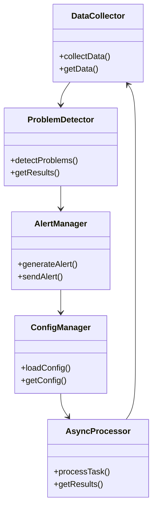

为了在设计文档中增加必要的结构体说明，我将为 OS Dark 系统提供每个模块中使用的关键结构体的详细描述。以下是改进后的设计文档内容，包括结构体说明：

---

# OS Dark 系统设计文档

## 1. 系统概述

OS Dark 是一个用于监控和分析操作系统状态的工具。它能够检测系统重启、内核崩溃、内存不足、磁盘空间不足、网络连接问题等事件，并生成详细的系统报告和警报。该工具采用模块化设计，支持跨平台（Windows 和 Linux/Unix），并提供异步处理和可配置的警报系统。

## 2. 系统架构

### 2.1 整体架构

OS Dark 采用组件化架构，主要由以下几个核心模块组成：

- **数据收集模块**：负责从系统中提取必要的信息，如系统日志、进程状态和内存使用情况。
- **问题检测模块**：通过分析收集到的数据来识别潜在的系统问题。
- **数据存储模块**：负责将收集到的数据和生成的报告存储到文件系统中。
- **警报管理模块**：负责生成和发送警报。
- **配置管理模块**：负责加载和管理系统配置。
- **异步处理模块**：提供线程池，支持异步任务执行。

### 2.2 系统框图

系统框图展示了各模块之间的交互和数据流动。每个模块通过接口进行通信，确保模块的独立性和可扩展性。

```
+------------------+     +------------------+     +------------------+
|   数据收集模块    | --> |   问题检测模块    | --> |   警报管理模块    |
+------------------+     +------------------+     +------------------+
         |                      |                      |
         v                      v                      v
+------------------+     +------------------+     +------------------+
|   数据存储模块    | <-- |   配置管理模块    | <-- |   异步处理模块    |
+------------------+     +------------------+     +------------------+
```

### 2.3 设计模式

OS Dark 采用了多种设计模式以提高系统的灵活性和可维护性：

- **工厂模式**：用于创建各种组件。
- **单例模式**：确保某些关键组件如配置管理器和警报管理器在系统中只有一个实例。
- **策略模式**：允许不同的检测器实现不同的检测策略。
- **观察者模式**：用于警报系统，当检测到问题时通知观察者。
- **依赖注入**：通过构造函数注入依赖，提高代码的可测试性和灵活性。

## 3. 核心模块详细设计

### 3.1 数据收集模块

- **功能**：从系统中提取必要的信息，如系统日志、进程状态和内存使用情况。
- **接口**：提供数据收集的 API，供问题检测模块调用。
- **数据流**：收集的数据被传递到问题检测模块进行分析。
- **具体实现**：使用系统 API 读取日志文件、进程信息和内存使用情况。

#### 结构体说明

- **`SystemLog`**：存储系统日志信息。
  ```cpp
  struct SystemLog {
      std::string timestamp;
      std::string level;
      std::string message;
  };
  ```

- **`ProcessInfo`**：存储进程信息。
  ```cpp
  struct ProcessInfo {
      int pid;
      std::string name;
      double cpuUsage;
      double memoryUsage;
  };
  ```

- **`MemoryInfo`**：存储内存使用情况。
  ```cpp
  struct MemoryInfo {
      double totalMemory;
      double usedMemory;
      double freeMemory;
  };
  ```

### 3.2 问题检测模块

- **功能**：通过分析收集到的数据来识别潜在的系统问题。
- **接口**：提供问题检测的 API，供警报管理模块调用。
- **数据流**：分析后的结果被传递到警报管理模块进行处理。
- **具体实现**：使用正则表达式和数据分析算法来检测异常。

#### 结构体说明

- **`Problem`**：存储检测到的问题信息。
  ```cpp
  struct Problem {
      std::string type;
      std::string description;
      std::string severity;
  };
  ```

### 3.3 数据存储模块

- **功能**：负责将收集到的数据和生成的报告存储到文件系统中。
- **接口**：提供数据存储的 API，供其他模块调用。
- **数据流**：存储的数据可以被其他模块读取和分析。
- **具体实现**：使用文件 I/O 操作将数据写入文件。

#### 结构体说明

- **`Report`**：存储生成的报告信息。
  ```cpp
  struct Report {
      std::string timestamp;
      std::vector<Problem> problems;
      std::string summary;
  };
  ```

### 3.4 警报管理模块

- **功能**：负责生成和发送警报。
- **接口**：提供警报管理的 API，供其他模块调用。
- **数据流**：生成的警报被发送给用户，并存储在系统中。
- **具体实现**：使用 SMTP 协议发送电子邮件警报。

#### 结构体说明

- **`Alert`**：存储警报信息。
  ```cpp
  struct Alert {
      std::string level;
      std::string message;
      std::string recipient;
  };
  ```

### 3.5 配置管理模块

- **功能**：负责加载和管理系统配置。
- **接口**：提供配置管理的 API，供其他模块调用。
- **数据流**：配置数据被传递到其他模块进行使用。
- **具体实现**：从 JSON 或 YAML 文件中读取配置。

#### 结构体说明

- **`Config`**：存储系统配置信息。
  ```cpp
  struct Config {
      std::string logPath;
      std::string reportPath;
      std::string smtpServer;
      std::string smtpPort;
      std::string smtpUsername;
      std::string smtpPassword;
  };
  ```

### 3.6 异步处理模块

- **功能**：通过线程池实现异步任务的执行。
- **接口**：提供异步处理的 API，供其他模块调用。
- **数据流**：异步任务的结果被传递到其他模块进行处理。
- **具体实现**：使用 C++ 标准库的线程池实现。

#### 结构体说明

- **`Task`**：存储异步任务信息。
  ```cpp
  struct Task {
      std::function<void()> function;
      std::string description;
  };
  ```

## 4. UML 类图

UML 类图展示了系统中各类之间的关系和交互。



## 5. 工作流程

系统的工作流程包括加载配置文件、启动异步处理器、收集数据、检测问题、生成报告、创建警报并发送，最后停止异步处理器。

## 6. 交互时序图

交互时序图展示了系统中各模块之间的交互和数据流动。

```
+------------------+     +------------------+     +------------------+
|   数据收集模块    | --> |   问题检测模块    | --> |   警报管理模块    |
+------------------+     +------------------+     +------------------+
         |                      |                      |
         v                      v                      v
+------------------+     +------------------+     +------------------+
|   数据存储模块    | <-- |   配置管理模块    | <-- |   异步处理模块    |
+------------------+     +------------------+     +------------------+
```

## 7. 跨平台支持

OS Dark 支持 Windows 和 Linux/Unix 平台。不同平台使用各自的 API 和工具来实现功能。

## 8. 扩展性设计

系统设计时考虑了扩展性，用户可以轻松添加新的检测器、数据收集器和警报类型，以满足不同的需求。

## 9. 性能和安全性考虑

系统通过异步处理和智能指针管理内存来提高性能，并通过加密存储敏感数据和安全的网络连接测试来确保安全性。

## 10. 未来扩展方向

未来，OS Dark 可以通过开发 Web 界面、支持分布式监控、引入机器学习等方式进一步增强其功能。